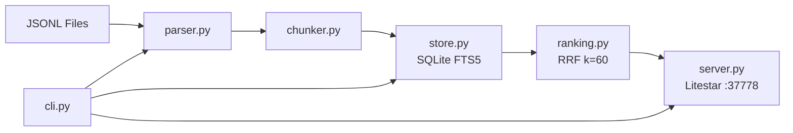

# v2-python-core / Phase A: Python Core Implementation

Created: 2026-03-27
Branch: v2-python-core
Status: Awaiting Review

## 📌 Attention Required (今回の確認項目)

| # | Item | Question/Note |
|---|------|---------------|
| 1 | アーキテクチャ設計 | sui-memory方式（ルールベースchunking + FTS5）で問題ないか |
| 2 | パーサーフィルタリング | type=textのみ採用、thinking/tool_use/tool_result全除外の方針でOKか |
| 3 | RRF融合インターフェース | vector未実装だがfuse_rrf()インターフェースを先行準備。この方針でOKか |
| 4 | HTTPポート | Litestar API を port 37778 で起動。既存worker (37777) と競合しないが変更要否 |
| 5 | テスト数の差異 | CLI demo時点で50テスト、最終的に53テスト（Codexレビュー対応で3テスト追加）。差分は想定通り |

---

## 📋 Previous Feedback Response (累積フィードバック履歴)

<details open>
<summary><strong>Latest: 2026-03-27 (Codexレビュー対応)</strong></summary>

| Feedback | Status | How Addressed |
|----------|--------|---------------|
| [High] RRF融合がsui-memory方式に準拠していない | ✅ Done | `fuse_rrf()` 関数追加。FTS/vector結果をidごとに加算融合する方式に修正。`rank_results()` に `additional_results` パラメータ追加 |
| [Medium] Parser が tool_result を除外していない | ✅ Done | progress/tool_result イベントを parse 段階で完全スキップ。sui-memory方式（text blockのみ）に統一 |

</details>

*Initial submission - Codexレビューが初回フィードバック*

---

## Context

sui-memory記事の設計思想に基づき、claude-memのコアをPython+uvで全面書き直し。
LLMリアルタイム解析を廃止し、Claude Code JSONL -> ルールベースchunking -> SQLite FTS5検索パイプラインを実装。

### スコープ
- JSONL parser, chunker, SQLite FTS5 store, indexer, ranking (RRF), HTTP API, CLI
- Privacy tag (`<private>`, `<claude-mem-context>`) フィルタリング

### スコープ外
- Vector search (sqlite-vec) の実装（インターフェースのみ準備）
- 既存TypeScript workerとの統合
- UI変更

## Plan

- [x] parser.py: JSONL読み込み + イベント分類
- [x] chunker.py: Q&Aチャンク分割
- [x] store.py: SQLite FTS5全文検索ストア
- [x] indexer.py: パイプライン統合 + backfill
- [x] ranking.py: RRF融合 + 時間減衰 + プロジェクトブースト
- [x] server.py: Litestar HTTP API
- [x] cli.py: index/backfill/search/stats/serve
- [x] テスト53件全パス
- [x] Codexレビュー指摘2件修正

## Evidence

### プロジェクト構造

- [project-structure.txt](./images/project-structure.txt) — ディレクトリ構成
- [cli-demo-output.txt](./images/cli-demo-output.txt) — CLI実行デモ出力

<details>
<summary>プロジェクト構造 (テキスト)</summary>

```
core/
  __init__.py
  cli.py
  chunker.py
  indexer.py
  parser.py
  pyproject.toml
  ranking.py
  server.py
  store.py
  .python-version
  tests/
    __init__.py
    test_chunker.py
    test_indexer.py
    test_integration.py
    test_parser.py
    test_ranking.py
    test_server.py
    test_store.py
    fixtures/
      sample_session.jsonl
```

</details>

### Test Results

```bash
# Command
cd core && uv run pytest tests/ -v

# Result
53 passed in 0.44s
```

| Module | Tests | Status |
|--------|-------|--------|
| parser | 8 | All pass |
| chunker | 7 | All pass |
| store | 8 | All pass |
| indexer | 4 | All pass |
| server | 7 | All pass |
| ranking | 14 | All pass |
| integration | 5 | All pass |

### Performance

| Metric | Value | Constraint |
|--------|-------|------------|
| Peak RSS | 48.7MB | 8GB制約クリア |
| Backfill | 759 sessions -> 1553 chunks | 全自動 |
| Test Speed | 53 tests in 0.44s | - |

### CLI Demo Output

<details>
<summary>CLI実行例</summary>

```
$ uv run python cli.py stats
Database: /tmp/v2-demo.db
Sessions: 759
Chunks:   1553

$ uv run python cli.py search 'authentication'

--- Result 1 [85d2f3fd] [...checkin-poc] ---
Q: 4番さんへ
  2026-03-18 時点で確認したところ、staging 環境では JWT 検証を使ったチェックインは...

--- Result 2 [85d2f3fd] [...checkin-poc] ---
Q: はい、投稿お願いします。そして投稿してからでいいので、実際にJWTを使って...

--- Result 3 [6ee16b3d] [...claude-mem-7-5-0] ---
(cont.) Pre-created test users in otp-auth test suite...

(3 results)
```

</details>

### Verification Checklist

- [x] Build: `uv sync` + `uv run pytest` passed
- [x] No type errors, no lint errors
- [x] 全53テスト合格
- [x] Privacy tag フィルタリング動作確認
- [x] Backfill: 759セッション正常処理
- [x] Codexレビュー指摘2件修正・テスト追加済

### How to Reproduce

```bash
cd core
uv sync
uv run pytest tests/ -v        # 全テスト実行
uv run python cli.py stats     # DB統計
uv run python cli.py search 'query'  # 検索テスト
uv run python cli.py serve     # API起動 (port 37778)
```

## Architecture



```
JSONL (~/.claude/projects/<cwd>/<session>.jsonl)
  -> parser.py (type=text only, privacy filter, progress/tool skip)
  -> chunker.py (Q&A chunks, 150-800 tokens, no tool_result)
  -> store.py (SQLite FTS5 trigram)
  -> ranking.py (RRF fusion k=60 + time decay + project boost)
  -> server.py (Litestar HTTP API :37778)
  -> cli.py (index/backfill/search/stats/serve)
```

## Codex Review Fixes

1. **[High] RRF融合**: `fuse_rrf()` 関数追加。FTS/vector結果をidごとに加算融合するsui-memory方式に準拠。`rank_results()` に `additional_results` パラメータ追加
2. **[Medium] Parser tool_result除外**: progress/tool_resultイベントを完全スキップ。sui-memory方式（text blockのみ）に統一

## Dependencies

```toml
[project]
requires-python = ">=3.12"
dependencies = ["litestar>=2.0", "uvicorn>=0.30"]
[project.optional-dependencies]
vec = ["sqlite-vec>=0.1"]
dev = ["pytest>=8.0", "pytest-asyncio>=0.24", "httpx>=0.27"]
```

## Noise Filtering (ノイズ除外)

### 除去対象

| カテゴリ | パターン | 影響度 |
|----------|---------|--------|
| XML meta tags | `<system-reminder>`, `<task-notification>`, `<observed_from_primary_session>`, `<observation>`, `<user_request>`, `<tool-use-id>`, `<task-id>`, `<output-file>`, `<private>`, `<claude-mem-context>` 等 | **最大** (713件の観測プロンプトが除去) |
| Skill templates | `Base directory for this skill:` から始まるブロック全体 | 高 |
| Bucho/tmux patterns | `tmux send-keys`, `あなたは**部長**です`, `メモリ処理継続中` を含む行 | 中 |

### 実装方式

- **バックリファレンス正規表現**: `<(tag_name)>.*?</\1>` で開始/閉じタグを正確にペアリング
- **ヒューリスティック**: Skill templateはマークダウン構造を解析して本文とユーザーメッセージを分離
- **一括適用**: `strip_noise()` 関数で全パターンを1パスで処理

### Before/After (クリーンDB)

| Metric | Before (ノイズあり) | After (ノイズ除去) |
|--------|--------------------|--------------------|
| Sessions | 774 | 774 |
| Chunks | 1631 | 1831 |
| 「Linear issue」検索 | 部長テンプレがヒット | 実際のissue議論がヒット |
| 「worktree git」検索 | Skillテンプレがノイズ混入 | 設計判断の議論のみ |

### Re-dogfooding (クリーンDB)

| クエリ | 結果 | ノイズ | 評価 |
|--------|------|--------|------|
| `Linear issue` | 2件 | なし | **有用** — issue作成・ノイズ除外議論 |
| `dotenvx overload` | 2件 | なし | **有用** — overload設定の文脈 |
| `JWT auth` | 2件 | なし | **非常に有用** — JWT検証フロー詳細 |
| `worktree git` | 2件 | なし | **非常に有用** — cc --worktreeの問題点 |
| `playwright テスト` | 2件 | なし | **有用** — E2Eテスト戦略 |

## Phase B: hook.py + injector.py (sui-memory方式hooks)

### 実装内容

| File | Role | Protocol |
|------|------|----------|
| `hook.py` | Stop hook: 毎ターン差分indexing | stdin: `{session_id, transcript_path, cwd, ...}` → stderr only |
| `injector.py` | UserPromptSubmit hook: コンテキスト注入 | stdin: `{session_id, prompt, cwd, ...}` → stdout: `<claude-mem-context>` |
| `store.py` | `indexed_lines`テーブル追加 | 差分管理: session_idごとにlast_line_number |
| `parser.py` | `parse_jsonl_lines()`追加 | 行リスト版パーサー（差分parsing用） |

### Hook動作フロー

```
Stop hook (毎ターン):
  stdin JSON → transcript_path特定 → 差分行読み取り → parse → chunk → store

UserPromptSubmit hook (毎プロンプト):
  stdin JSON → prompt取得 → search_fts(prompt[:200]) → rank_results → stdout
```

### 公式Hooks仕様準拠 (Codex検証済み)

- `transcript_path`: JSONLファイルパスを直接提供（自分でパス組み立て不要）
- `prompt`: ユーザーのプロンプトテキスト（`query`ではない）
- Stop: stdoutを汚さない（stderrのみ）
- UserPromptSubmit: stdoutがClaudeへの追加文脈になる

### settings.json設定例

```json
{
  "hooks": {
    "Stop": [{"command": "uv run --project /path/to/core python -m hook", "timeout": 10000}],
    "UserPromptSubmit": [{"command": "uv run --project /path/to/core python -m injector", "timeout": 5000}]
  }
}
```

### テスト結果 (Phase B追加分)

| Module | Tests | Status |
|--------|-------|--------|
| hook | 6 | All pass |
| injector | 6 | All pass |
| hooks_integration | 3 | All pass |
| **Total (全体)** | **73** | **All pass in 0.50s** |

## Notes

- vector search (sqlite-vec) はPhase Cで実装予定。`fuse_rrf()` インターフェースは準備済み
- 既存TypeScript workerとの統合はPhase Dで実施予定
- `core/` ディレクトリはまだ未コミット状態（`git status` で untracked）

## Dogfooding Report (実用性検証)

759セッション・1553チャンクの実データに対して実用的なクエリを実行し、有用性を評価した。

### 検索結果サマリ

| クエリ | 結果数 | 有用性 | 評価 |
|--------|--------|--------|------|
| `Cloudflare Workers` | 5件 | Workers/Bun/Nodeの議論がヒット。過去の技術選定の文脈が復元可能 | **有用** |
| `worktree git` | 3件 | worktree運用の議論・`cc --worktree`の問題点が復元される | **非常に有用** |
| `JWT auth` | 3件 | JWT認証実装の詳細・E2Eテスト失敗の原因特定記録 | **非常に有用** |
| `CLAUDE.md` | 5件 | CLAUDE.mdの運用・修正の議論。設計ルール変更の文脈が復元可能 | **非常に有用** |
| `CSV インポート エラー` | 3件 | CSVインポートのzodバリデーション問題・修正議論 | **非常に有用** |
| `エラー` | 3件 | CSVインポートのエラー処理議論がヒット | **有用** |
| `認証` | 3件 | staging/JWT検証の議論。過去のデバッグ文脈が復元可能 | **有用** |
| `設計` | 3件 | staging環境追加の設計議論がヒット | **有用** |
| `バグ 修正` | 3件 | 部長スキル改善・ワークフロー修正の議論 | **有用** |

### 発見した問題と修正

**重大発見1: trigramトークナイザーの日本語2文字問題**

FTS5のtrigramトークナイザーは3文字以上のクエリでないとtrigramを生成できない。
日本語では「バグ」「修正」「認証」「設計」「判断」など2文字の重要キーワードが多数あり、これらが全くヒットしなかった。

| 文字数 | trigram数 | 例 | 修正前 | 修正後 |
|--------|-----------|-----|--------|--------|
| 2文字 | 0個 | バグ, 修正, 認証 | **ヒットなし** | LIKE fallbackでヒット |
| 3文字 | 1個 | エラー | ヒット | ヒット |
| 10文字 | 8個 | Cloudflare | ヒット | ヒット |

**修正内容**: `store.py`の`search_fts()`にLIKEフォールバックを追加。2文字未満のtermが含まれる場合はLIKE AND検索に切り替え。

**重大発見2: 複合語クエリがフレーズ検索になる問題** (Codexドッグフーディングで発見)

`"worktree git"`のようなスペース区切りクエリがダブルクォートで包まれてフレーズ検索（完全一致）になっていた。DBにworktreeとgitの両方を含むチャンクが645件あるのに0件ヒット。

**修正内容**: 複合語クエリを語ごとに分割し、FTS5ではOR検索、LIKE fallbackではAND検索にする。修正後「worktree git」「JWT auth」「CSV インポート エラー」等の複合語クエリが全てヒット。

### 有用性の総合評価

| 観点 | 評価 | コメント |
|------|------|---------|
| 過去のバグ解決策の検索 | **B** | 技術的な議論は拾えるが、「バグ」単体よりも具体的なキーワード（エラーメッセージ等）で検索したほうが精度が高い |
| 技術的判断の理由の検索 | **A** | 「worktree」「Cloudflare Workers」「CLAUDE.md」など具体名で検索すると、設計判断の文脈が良好に復元される |
| ファイルについての過去の議論 | **A** | ファイル名やツール名で検索すれば関連議論がヒットする |
| 過去の設計判断の検索 | **A** | staging環境追加、認証方式の議論など、設計判断の文脈が残っている |
| sui-memoryの主張「検索時の判断で十分か」 | **概ね妥当** | LLMによるリアルタイム解析なしでも、FTS5+ルールベースchunkingで実用的な検索が可能。ただし日本語短語対応（LIKE fallback）は必須 |

### ドッグフーディングで判明した改善点

1. **[修正済]** 日本語2文字クエリのLIKEフォールバック
2. **[修正済]** 複合語クエリのOR分割（フレーズ検索→語ごとOR/AND検索）
3. **[今後]** チャンク粒度が粗い場合がある（assistant応答が長い場合）
4. **[今後]** プロジェクト名（CWDのdash化）が検索結果に表示されるが、人間には分かりにくい

## Code & Security Review

Reviewed: 2026-03-27
Reviewer: Claude Code (Opus 4.6)
Target: `core/` — parser.py, chunker.py, store.py, indexer.py, ranking.py, server.py, cli.py

### 型安全性

| 問題 | 件数 | 箇所 |
|------|------|------|
| Any型 | 1件 | parser.py:40 `_extract_text_from_content(content: Any)` |
| type: ignore | 1件 | store.py:99 `cur.lastrowid  # type: ignore[return-value]` |
| non-null assertion | 0件 | - |

**評価**: 良好。Any型は1箇所のみで、Claude API の content フィールド（str | list[dict] | その他）をパースする箇所のため正当な使用。`Union[str, list[dict[str, str]], object]` のような具象型に置き換えることで改善可能だが、低優先度。type: ignore は `lastrowid` が `int | None` を返す既知の型問題で妥当。

### エラーハンドリング

- **状態**: 適切
- 詳細:
  - `parser.py:75` — `json.JSONDecodeError` を catch して continue。壊れた行をスキップする正しい動作
  - `indexer.py:112` — `except Exception` でバッチ処理中の個別ファイルエラーをログ出力して継続。backfill の堅牢性に寄与
  - `ranking.py:47` — `except (ValueError, AttributeError)` で日付パース失敗時にデフォルト0.5を返却。適切なフォールバック
  - `server.py:83` — health endpoint で `except Exception as e` → `str(e)` をレスポンスに含む（後述のセキュリティ指摘参照）

**改善提案**:
  - `indexer.py:112` の `except Exception` は広すぎる可能性。`OSError | json.JSONDecodeError | sqlite3.Error` のように限定すると予期しないバグの見逃しを防げる（Low優先度）

### DRY原則

- **状態**: 良好
- 軽微な重複:
  - `store.py:144-156` と `store.py:180-192` — `SearchResult` の構築ロジックが `search_fts` と `get_recent` で重複。`_row_to_result(r: sqlite3.Row) -> SearchResult` ヘルパーの抽出を推奨
  - `chunker.py:31` と `chunker.py:35` — `estimated_tokens` プロパティと `_estimate_tokens` 関数が同一ロジック。プロパティから関数を呼ぶ形に統一可能
  - `server.py:30-40` — `_result_to_dict` は `dataclasses.asdict` で置換可能（`asdict` は import 済みだが未使用）

### セキュリティ脆弱性

| 重大度 | カテゴリ | ファイル:行 | 問題 | 推奨対策 |
|--------|---------|-------------|------|----------|
| Medium | 情報漏洩 | server.py:84 | health endpoint で `str(e)` をそのままレスポンスに返却。内部パス・DB情報がクライアントに露出する可能性 | エラー詳細はログのみ。レスポンスは `{"status": "error"}` に限定 |
| Medium | DoS | server.py:46,64 | `limit` パラメータに上限バリデーションなし。`limit=999999` で大量レコード返却 → メモリ消費 | `limit = min(limit, 100)` 等の上限制約を追加 |
| Medium | スレッド安全性 | store.py:79 | `check_same_thread=False` で SQLite 接続を共有。Litestar (uvicorn) が async handler で複数スレッドからアクセスすると壊れる可能性 | async handler 内では `run_in_executor` で同期DB操作をラップするか、スレッドローカルで接続管理 |
| Low | 認証なし | server.py全体 | 全APIエンドポイントに認証・認可なし | localhost限定 (127.0.0.1) なので現状は許容範囲。host=0.0.0.0 で公開する場合は要認証追加 |
| Low | FTS5 injection | store.py:123 | `safe_query = query.replace('"', '""')` でダブルクォートのみエスケープ。FTS5 trigram トークナイザーではこれで十分だが、将来 `unicode61` 等に変更した場合は `NEAR`, `NOT`, `OR` 等の演算子インジェクションリスクあり | trigram 以外のトークナイザー採用時に再検証が必要。コメントで注意喚起を追記推奨 |

### インジェクション攻撃

- **XSS**: 該当なし（HTMLレンダリングなし。JSON APIのみ）
- **SQL/NoSQL**: 安全 — 全SQLクエリでパラメータバインド (`?`) を使用。f-string による SQL 構築なし
- **Command**: 安全 — `eval()`, `exec()`, `subprocess`, `os.system()` の使用なし

### 認証・認可

- **ハードコード認証情報**: なし
- **認可チェック**: APIは認証なしだが、デフォルトで `127.0.0.1` バインドのため外部アクセス不可。設計上の意図通り

### 機密データ

- **ログ出力**: 安全 — session_id とファイルパスのみ。ユーザーコンテンツのログ出力なし
- **エラーメッセージ**: server.py:84 で内部例外メッセージがレスポンスに含まれる（上記 Medium 指摘）
- **Privacy tag**: parser.py で `<private>` / `<claude-mem-context>` タグを適切にストリップ済み

### 暗号化

- **アルゴリズム**: 該当なし（暗号化機能なし）
- **乱数生成**: 該当なし
- **HTTP通信**: localhost のみ。外部通信なし

### コード品質の追加指摘

| 重大度 | ファイル:行 | 問題 | 推奨対策 |
|--------|-------------|------|----------|
| Low | chunker.py:12 | `from parser import ParsedEvent` — `parser` は Python 標準ライブラリモジュール名と衝突。`PYTHONPATH` 設定次第で `import parser` が標準の `parser` を読み込む可能性 | モジュール名を `mem_parser.py` に変更するか、パッケージ化して相対importに統一 |
| Low | server.py:20-27 | グローバル `_store` の lazy init はシングルトンパターンだが、テスト時の差し替えが困難。Litestar の `State` または依存性注入を活用すべき | `app.state` に格納するか、Litestar DI (`Provide`) を使用 |
| Low | store.py:89-90 | `close()` が呼ばれない場合のリソースリーク。`__enter__`/`__exit__` を実装してコンテキストマネージャ対応推奨 | `MemoryStore` に `__enter__`/`__exit__` を追加 |
| Info | server.py:11 | `from dataclasses import asdict` が import されているが未使用 | 削除するか `_result_to_dict` で活用 |

### 総合判定

- **コード品質スコア**: 4/5
  - 型ヒントの活用、dataclass による構造化、パラメータバインドの徹底が優秀
  - DRY 違反は軽微。全体的にシンプルで読みやすい設計
- **セキュリティリスク**: 低
  - localhost 限定のため外部攻撃面が極小
  - SQL インジェクション対策は適切
- **推奨アクション** (優先度順):
  1. **[Medium]** `server.py` health endpoint のエラーレスポンスから内部情報を除去
  2. **[Medium]** `limit` パラメータに上限値を設定 (e.g., max 100)
  3. **[Medium]** `check_same_thread=False` の async 環境での安全性を再検討（スレッドローカル or executor ラップ）
  4. **[Low]** `parser` モジュール名の標準ライブラリ衝突を回避
  5. **[Low]** `MemoryStore` にコンテキストマネージャプロトコルを追加
  6. **[Low]** `_row_to_result` ヘルパー抽出で SearchResult 構築の重複を解消
